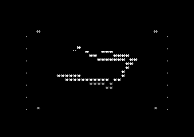

# C64 ASC Uber Cube

[](https://github.com/djayuffe/c64-asc-ubercube/actions/workflows/ci.yml)

C64 ASC Uber Cube is a self-contained Commodore 64 PAL demo written in 6510 assembly for the [ACME assembler](https://sourceforge.net/projects/acme-crossass/). It combines a three-voice SID soundtrack with a precomputed XYZ wireframe cube, beat-reactive visual accents, and live section changes.

The demo is built for the constraints that make C64 effects compelling: a 1 MHz 6510, VIC-II character graphics, SID music, and a PAL 50 Hz frame cadence. Instead of spending frame time on runtime 3D projection, it selects from precomputed wireframe banks and uses the saved time for clean erase/draw passes, beat-driven size and spin changes, and safe live transitions between musical sections.

The code is a compact, buildable release: no external runtime files, no generated source, and no framework beyond the standard C64 hardware and ACME.

## Live screenshot


Native VICE capture of the PRG built from the current release source. The renderer's guarded coordinate window keeps the cube and reactive accents inside the intended visual area.



Fresh PAL VICE runtime capture generated from the current `c64_asc_ubercube.prg`
after the demo reached its IRQ-driven render loop. It shows a later wireframe
pose with the bounded rails and beat-reactive spark field.


Boot-validation capture: the PRG was autostarted from its `SYS 2064` BASIC loader and allowed to reach its first rendered frames.

## Features

- True precomputed XYZ wireframe cube with normal, zoom-in, and rebound frame banks.
- PAL 50 Hz audio/visual cadence: a raster IRQ advances the SID player while the main loop consumes a bounded visual-tick queue.
- Beat-driven zoom and bidirectional spin, with kick, snare, hat, crash, lift, and lead-note reactive accents.
- Four bounded visual/tail modes; `SPACE` advances to the next top-level music section and safely switches its visual state.
- Dirty erase/draw renderer with stream guards, coordinate validation, and a protected top/bottom display area.
- KERNAL-safe IRQ chaining through `$EA31`, so the custom `$0314` vector follows the C64 IRQ contract.
- Static audit script that checks labels, control-flow references, branch-distance risks, renderer bounds, cube-frame data, and release invariants before assembly.

## What the demo does

At startup, the BASIC loader transfers control to the 6510 entry point at `$0810`. The demo initializes the SID voices, clears and prepares the character display, installs a PAL raster IRQ, and enters a small main loop. From then on, the IRQ drives music timing while the main loop renders the cube whenever a new visual tick is available.

The centrepiece is not a general-purpose floating-point 3D engine. The cube's wireframe is stored as compact, precomputed coordinate streams: 16 normal poses, 16 enlarged poses, and 16 rebound poses. The beat envelope selects the appropriate bank, while spin state selects a pose within it. This is a deliberate C64 trade-off: predictable visual timing and clean full-frame updates are more valuable here than calculating projection at runtime.

Music and visuals remain linked without sharing unsafe state. Drum and lead events feed bounded envelopes; the renderer turns those envelopes into zoom, spin, tails, and panel accents. Pressing `SPACE` requests a transition, and the music IRQ applies it at a safe point so order and pattern pointers never race the main loop.

## Runtime model

```text
BASIC RUN -> SYS 2064 -> init at $0810
                         |
                         +-> SID, VIC-II, CIA setup and raster IRQ installation
                         |
PAL raster IRQ (50 Hz) -> play music -> queue up to two visual ticks -> KERNAL tail
                         |
main loop --------------> consume one tick -> read SPACE -> render frame
```

The two-tick queue smooths brief main-loop delays without allowing an unlimited rendering backlog. Details of the IRQ contract, memory map, and draw order are in the [architecture guide](docs/architecture.md).

## Quick start

### Requirements

- [ACME](https://sourceforge.net/projects/acme-crossass/) on your `PATH`.
- VICE's `x64sc` command on your `PATH` to run it in an emulator.

### Build and run

```sh
./build.sh
x64sc -autostartprgmode 1 -autostart c64_asc_ubercube.prg
```

`build.sh` first runs the static audit, then assembles `c64_asc_ubercube.asm` into `c64_asc_ubercube.prg`. The PRG is intentionally ignored by Git because it is reproducible from source.

### Real C64 hardware

Copy `c64_asc_ubercube.prg` to suitable media, load it, and enter:

```basic
RUN
```

The embedded BASIC loader starts the machine-code entry point at `$0810` (`SYS 2064`). The display timing is designed for a PAL C64; it has not been calibrated for NTSC machines.

## Controls

| Key | Action |
| --- | --- |
| `SPACE` | Move to the next top-level music section. The change also cycles the visual effect, tail mode, and short music-transition preset. |

The input is edge-detected and debounced. Keyboard polling only raises a request; the SID IRQ consumes that request so song pointers cannot be modified concurrently with music playback.

## Compatibility and scope

- **Target:** PAL Commodore 64 timing (50 Hz), 6510 CPU, VIC-II text display, and SID audio.
- **Emulator:** verified with VICE `x64sc` using a PAL C64 configuration.
- **Hardware:** the output is a normal C64 PRG and can be loaded with `RUN`; final audio/visual calibration on a physical machine remains the responsibility of the release operator.
- **Not a library:** this is a compact demo source, not a reusable 3D, music, or game engine.

The project intentionally has no external runtime assets or toolchain lockfile. ACME produces the PRG directly from the checked-in assembly source.

## Project layout

```text
assets/
  c64-asc-ubercube-live.png Current verified native VICE screenshot used above
  c64-asc-ubercube-boot.png Native VICE capture from the validated boot path
  c64-asc-ubercube-runtime.png Fresh PAL VICE capture from the current audited PRG
  uber-cube-live.png      Earlier verified release capture
AUDIT_FINDINGS.md         Concise audit status and environment notes
RELEASE_NOTES.md          Release-focused change history
docs/
  architecture.md         Runtime flow, timing, renderer rules, and data safety
  development.md          Build, test, and release workflow
audit_static.py            Static release audit executed by build.sh
build.sh                   Audit-and-assemble entry point
c64_asc_ubercube.asm      Complete ACME/6510 source: SID engine and renderer
```

## Source tour

| Area | Main labels / files | Purpose |
| --- | --- | --- |
| Boot and timing | `init`, `irq`, `main_visual_loop` | Starts the C64 program, schedules music, and hands frame work to the renderer. |
| Music | `tune_init`, `play`, `next_step`, `next_order` | Maintains order/pattern state and writes SID registers. |
| Live control | `scan_space_skip`, `skip_to_next_part` | Debounces `SPACE` and applies a safe section/effect transition in the IRQ path. |
| Visuals | `visual_update` and `visual_*` helpers | Erases the previous frame, draws tails/accents, and streams the next cube pose. |
| Safety | `audit_static.py` | Checks the contracts that are difficult to spot by eye in a low-level demo. |

The detailed routine ownership and address map live in [docs/architecture.md](docs/architecture.md); the maintainer workflow is in [docs/development.md](docs/development.md).

## Verification

Run the complete local verification path with:

```sh
./audit_static.py c64_asc_ubercube.asm
./build.sh
git diff --check
git fsck --no-reflogs
```

During a VICE smoke test, let the cube run through several beats and press `SPACE` repeatedly. Confirm that the transition changes section and visuals without leaving stale lines, writing outside the protected display rows, or stalling the soundtrack.

### Troubleshooting

| Symptom | Check |
| --- | --- |
| `acme: command not found` | Install ACME and confirm `command -v acme` returns a path. |
| `./build.sh: Permission denied` | Restore the executable bit with `chmod +x build.sh audit_static.py`. |
| VICE opens but does not start the demo | Use `-autostartprgmode 1 -autostart c64_asc_ubercube.prg` after a successful build. |
| Visual timing differs from the screenshots | Confirm the emulator is configured as a PAL C64 rather than NTSC. |

## Technical reference

The [architecture guide](docs/architecture.md) documents the boot path, IRQ model, music/visual synchronization, safe renderer window, effect data, and the checks enforced by `audit_static.py`. The [technical reference](docs/technical-reference.md) provides the exact execution contracts, memory map, SID/visual relationship, precomputed frame model, and CI verification steps.

## Continuous integration and release artifacts

Every push and pull request runs the GitHub Actions **Build and audit**
workflow. It installs ACME, runs the full static audit, builds the PRG,
verifies the `$0801` load address, and publishes `c64_asc_ubercube.prg` as a
workflow artifact. Tagged releases attach the same reproducible PRG as a
downloadable release asset.

## Release material and attribution

This repository retains the release material included with the project. See [RELEASE_NOTES.md](RELEASE_NOTES.md) and [AUDIT_FINDINGS.md](AUDIT_FINDINGS.md) for the release history and audit scope. No license file was supplied with the imported source, so reuse terms have not been asserted or inferred.

The repository and the audited source use the same stable identity:
**C64 ASC Uber Cube** / `c64-asc-ubercube`. The PRG remains
`c64_asc_ubercube.prg`, matching the ACME source and reproducible build path.
