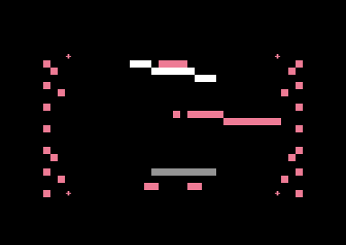
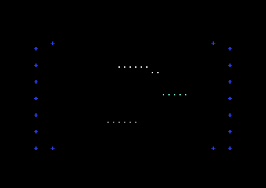

# C64 Padded

C64 Padded is a self-contained Commodore 64 PAL demo written in 6510 assembly for the [ACME assembler](https://sourceforge.net/projects/acme-crossass/). Its release source is internally named **C64 ASC Uber Cube**; it combines a three-voice SID soundtrack with a precomputed XYZ wireframe cube, beat-reactive visual accents, and live section changes.

The demo is built for the constraints that make C64 effects compelling: a 1 MHz 6510, VIC-II character graphics, SID music, and a PAL 50 Hz frame cadence. Instead of spending frame time on runtime 3D projection, it selects from precomputed wireframe banks and uses the saved time for clean erase/draw passes, beat-driven size and spin changes, and safe live transitions between musical sections.

The code is a compact, buildable release: no external runtime files, no generated source, and no framework beyond the standard C64 hardware and ACME.

## Live screenshot



Native VICE capture of the PRG built from the current release source. The renderer's guarded coordinate window keeps the cube and reactive accents inside the intended visual area.



Boot-validation capture: the PRG was autostarted from its `SYS 2064` BASIC loader and allowed to reach its first rendered frames.

## Features

- True precomputed XYZ wireframe cube with normal, zoom-in, and rebound frame banks.
- PAL 50 Hz audio/visual cadence: a raster IRQ advances the SID player while the main loop consumes a bounded visual-tick queue.
- Beat-driven zoom and bidirectional spin, with kick, snare, hat, crash, lift, and lead-note reactive accents.
- Four bounded visual/tail modes; `SPACE` advances to the next top-level music section and safely switches its visual state.
- Dirty erase/draw renderer with stream guards, coordinate validation, and a protected top/bottom display area.
- KERNAL-safe IRQ chaining through `$EA31`, so the custom `$0314` vector follows the C64 IRQ contract.
- Static audit script that checks labels, control-flow references, branch-distance risks, renderer bounds, cube-frame data, and release invariants before assembly.

## Quick start

### Requirements

- [ACME](https://sourceforge.net/projects/acme-crossass/) on your `PATH`.
- VICE's `x64sc` command on your `PATH` to run it in an emulator.

### Build and run

```sh
./build.sh
x64sc -autostartprgmode 1 -autostart c64_asc_ubercube.prg
```

`build.sh` first runs the static audit, then assembles `c64_asc_ubercube.asm` into `c64_asc_ubercube.prg`. The PRG is intentionally ignored by Git because it is reproducible from source.

### Real C64 hardware

Copy `c64_asc_ubercube.prg` to suitable media, load it, and enter:

```basic
RUN
```

The embedded BASIC loader starts the machine-code entry point at `$0810` (`SYS 2064`). The display timing is designed for a PAL C64; it has not been calibrated for NTSC machines.

## Controls

| Key | Action |
| --- | --- |
| `SPACE` | Move to the next top-level music section. The change also cycles the visual effect, tail mode, and short music-transition preset. |

The input is edge-detected and debounced. Keyboard polling only raises a request; the SID IRQ consumes that request so song pointers cannot be modified concurrently with music playback.

## Project layout

```text
assets/
  c64-padded-live.png     Current verified native VICE screenshot used above
  c64-padded-boot.png     Native VICE capture from the validated boot path
  uber-cube-live.png      Earlier verified release capture
AUDIT_FINDINGS.md         Concise audit status and environment notes
RELEASE_NOTES.md          Release-focused change history
docs/
  architecture.md         Runtime flow, timing, renderer rules, and data safety
  development.md          Build, test, and release workflow
audit_static.py            Static release audit executed by build.sh
build.sh                   Audit-and-assemble entry point
c64_asc_ubercube.asm      Complete ACME/6510 source: SID engine and renderer
```

## Verification

Run the complete local verification path with:

```sh
./audit_static.py c64_asc_ubercube.asm
./build.sh
git diff --check
git fsck --no-reflogs
```

During a VICE smoke test, let the cube run through several beats and press `SPACE` repeatedly. Confirm that the transition changes section and visuals without leaving stale lines, corrupting the scroller-safe rows, or stalling the soundtrack.

## Technical reference

The [architecture guide](docs/architecture.md) documents the boot path, IRQ model, music/visual synchronization, safe renderer window, effect data, and the checks enforced by `audit_static.py`.

## Release material and attribution

This repository retains the release material included with the project. See [RELEASE_NOTES.md](RELEASE_NOTES.md) and [AUDIT_FINDINGS.md](AUDIT_FINDINGS.md) for the release history and audit scope. No license file was supplied with the imported source, so reuse terms have not been asserted or inferred.
